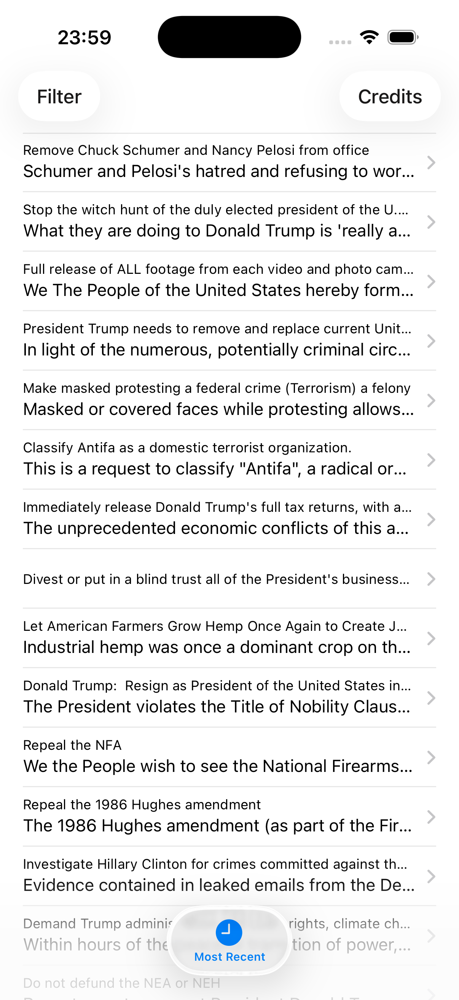
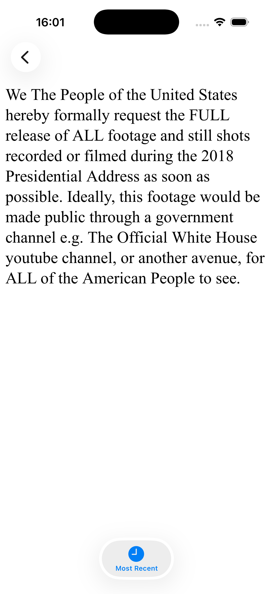
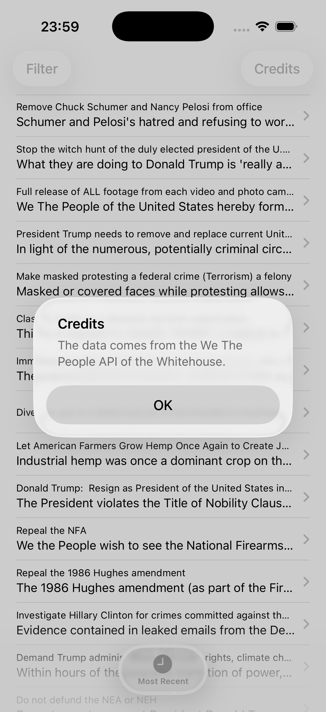
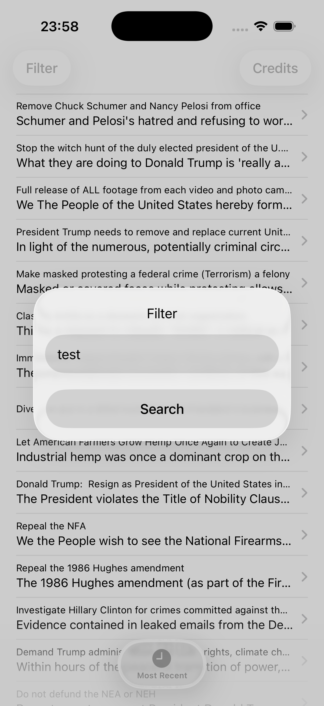
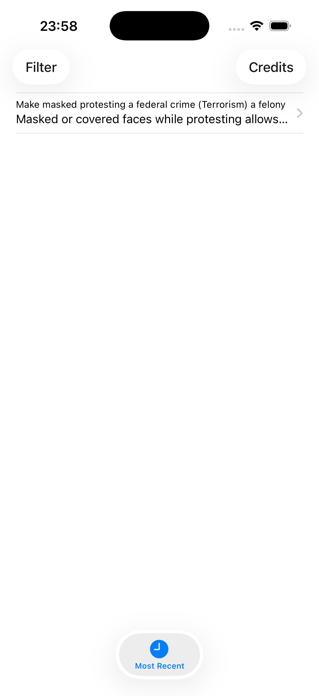

# Whitehouse Petitions

This app pulls petition data from the White House's We The People API and displays it in a list, with a detail screen for reading the full text of each petition.

## Features
- Fetches and parses petition data from JSON
- List and detail views for browsing petitions
- Filter button to search petitions by keyword
- Credits button showing the data source

## Screenshots

    
